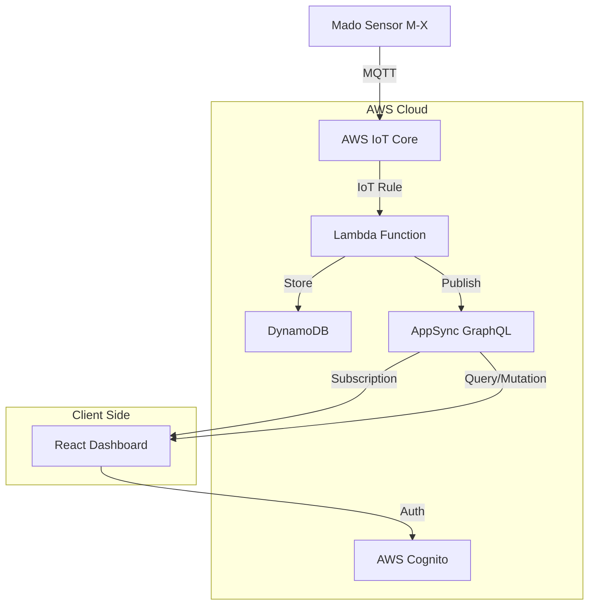

# Weather Dashboard 設計書

## 概要

AWS IoT Core、AppSync、DynamoDBを活用したサーバーレスアーキテクチャによる気象データダッシュボード。既存のCentraアプリケーションのReactフロントエンドに統合し、リアルタイム性とコスト効率を両立する。

## アーキテクチャ

### システム全体構成



### データフロー

1. **リアルタイムデータフロー**
   - Madoセンサー → IoT Core → Lambda → AppSync → React (WebSocket)
   - 遅延: < 100ms

2. **履歴データフロー**
   - React → AppSync Query → DynamoDB → React
   - TTL管理による自動データ削除

3. **統計データフロー**
   - Lambda → 10分間隔集計 → DynamoDB → AppSync → React

## コンポーネントとインターフェース

### バックエンドコンポーネント

#### 1. IoT Data Processor Lambda
```typescript
// 責務: IoTデータの受信、変換、保存、配信
interface IoTDataProcessor {
  // IoT Coreからのデータ受信
  handleIoTMessage(event: IoTEvent): Promise<void>
  
  // DynamoDBへの生データ保存
  saveRawData(sensorData: SensorData): Promise<void>
  
  // 統計データの計算と保存
  calculateAndSaveStats(deviceId: string): Promise<void>
  
  // AppSyncへのリアルタイム配信
  publishToAppSync(sensorData: SensorData): Promise<void>
}
```

#### 2. AppSync GraphQL API
```graphql
# スキーマ定義（要件書より）
type Query {
  getCurrentSensorData(deviceId: ID!): SensorData
  getRecentSensorData(deviceId: ID!, minutes: Int = 60): [SensorData!]!
  getSensorStats(deviceId: ID!, period: StatsPeriod = HOUR): SensorStats
}

type Subscription {
  onSensorDataUpdate(deviceId: ID!): SensorData!
}
```

#### 3. DynamoDB テーブル設計
```typescript
// テーブル名: CentraSensorData
interface DynamoDBRecord {
  PK: string              // "DEVICE#M-X"
  SK: string              // "2025-01-27T12:00:00.000Z#RAW" | "#STATS_10MIN"
  type: "RAW" | "STATS_10MIN"
  deviceId: string
  timestamp: string
  ttl: number            // RAW: 1時間, STATS: 24時間
  
  // 生データフィールド (type=RAW)
  temperature?: number
  humidity?: number
  pressure?: number
  windSpeed?: number
  windDirection?: number
  rainfall?: number
  illuminance?: number
  visibility?: number
  feelsLike?: number
  
  // 統計データフィールド (type=STATS_10MIN)
  stats?: {
    temperature: StatsValues
    humidity: StatsValues
    windSpeed: StatsValues
    samples: number
  }
}
```

### フロントエンドコンポーネント

#### 1. Weather Dashboard Page
```typescript
// /src/pages/Weather.tsx
interface WeatherDashboardPage {
  // ページレベルの状態管理
  // AppSyncクライアントの初期化
  // 認証状態の確認
}
```

#### 2. Real-time Data Display
```typescript
// /src/components/weather/RealtimeWeatherCard.tsx
interface RealtimeWeatherCard {
  deviceId: string
  // リアルタイムデータの表示
  // WebSocket接続状態の管理
  // データ更新アニメーション
}
```

#### 3. Historical Data Chart
```typescript
// /src/components/weather/WeatherHistoryChart.tsx
interface WeatherHistoryChart {
  deviceId: string
  timeRange: number // minutes
  dataType: WeatherDataType
  // Chart.jsまたはRechartsを使用
  // ズーム・パン機能
  // レスポンシブ対応
}
```

#### 4. Statistics Panel
```typescript
// /src/components/weather/WeatherStatsPanel.tsx
interface WeatherStatsPanel {
  deviceId: string
  period: StatsPeriod
  // 統計データの表示
  // 最大瞬間風速のハイライト
}
```

#### 5. Weather API Service
```typescript
// /src/services/weatherApi.ts
interface WeatherApiService {
  // AppSyncクライアントの設定
  getCurrentData(deviceId: string): Promise<SensorData>
  getHistoricalData(deviceId: string, minutes: number): Promise<SensorData[]>
  getStatistics(deviceId: string, period: StatsPeriod): Promise<SensorStats>
  subscribeToUpdates(deviceId: string, callback: (data: SensorData) => void): () => void
}
```

## データモデル

### TypeScript型定義

```typescript
// /src/types/weather.ts

export interface SensorData {
  deviceId: string
  timestamp: string
  temperature?: number      // ℃
  humidity?: number         // %
  pressure?: number         // hPa
  windSpeed?: number        // m/s
  windDirection?: number    // degrees
  rainfall?: number         // mm
  illuminance?: number      // lux
  visibility?: number       // km
  feelsLike?: number       // ℃
}

export interface SensorStats {
  deviceId: string
  period: string
  startTime: string
  endTime: string
  temperature?: StatsValues
  humidity?: StatsValues
  windSpeed?: StatsValues
  samples: number
}

export interface StatsValues {
  max: number
  min: number
  avg: number
}

export enum StatsPeriod {
  HOUR = "HOUR",
  DAY = "DAY"
}

export enum WeatherDataType {
  TEMPERATURE = "temperature",
  HUMIDITY = "humidity",
  PRESSURE = "pressure",
  WIND_SPEED = "windSpeed",
  WIND_DIRECTION = "windDirection",
  RAINFALL = "rainfall",
  ILLUMINANCE = "illuminance",
  VISIBILITY = "visibility",
  FEELS_LIKE = "feelsLike"
}
```

## エラーハンドリング

### エラー分類と対応

1. **ネットワークエラー**
   - WebSocket切断: 自動再接続（指数バックオフ）
   - GraphQLエラー: リトライ機構
   - タイムアウト: ユーザー通知とフォールバック

2. **データエラー**
   - 不正なセンサーデータ: バリデーション後スキップ
   - 欠損データ: 前回値の保持または補間
   - 統計計算エラー: エラーログ記録とデフォルト値

3. **認証エラー**
   - トークン期限切れ: 自動リフレッシュ
   - 権限不足: エラーページへリダイレクト

### エラー処理実装

```typescript
// /src/hooks/useWeatherData.ts
interface WeatherDataHook {
  data: SensorData | null
  loading: boolean
  error: Error | null
  connectionStatus: 'connected' | 'disconnected' | 'reconnecting'
  retry: () => void
}
```

## テスト戦略

### 単体テスト
- **Lambda関数**: Jest + AWS SDK Mock
- **React コンポーネント**: React Testing Library
- **API Service**: MSW (Mock Service Worker)

### 統合テスト
- **AppSync API**: GraphQL テストクライアント
- **DynamoDB**: DynamoDB Local
- **IoT Core**: IoT Device Simulator

### E2Eテスト
- **Cypress**: 主要ユーザーフローの自動テスト
- **リアルタイム機能**: WebSocket接続テスト

### パフォーマンステスト
- **Lighthouse**: フロントエンドパフォーマンス
- **Artillery**: API負荷テスト

## セキュリティ設計

### 認証・認可
- **Cognito User Pool**: ユーザー認証
- **AppSync**: GraphQL API認証
- **IAM Role**: Lambda実行権限

### データ保護
- **HTTPS**: 全通信の暗号化
- **VPC**: Lambda関数の分離
- **GraphQL Depth Limit**: DoS攻撃防止

### 監査ログ
- **CloudTrail**: API呼び出しログ
- **CloudWatch**: アプリケーションログ
- **X-Ray**: 分散トレーシング

## 運用・監視

### メトリクス
- **リアルタイム性**: データ遅延時間
- **可用性**: サービス稼働率
- **パフォーマンス**: レスポンス時間
- **コスト**: 月次AWS利用料金

### アラート
- **Lambda エラー率**: > 1%
- **DynamoDB スロットリング**: 発生時
- **AppSync 接続数**: > 8 (上限10の80%)

### ダッシュボード
- **CloudWatch Dashboard**: システム全体の監視
- **Cost Explorer**: コスト分析
- **Personal Health Dashboard**: AWS サービス状況

## デプロイメント

### Infrastructure as Code
- **AWS CDK**: インフラ定義
- **GitHub Actions**: CI/CD パイプライン
- **環境分離**: dev/staging/prod

### デプロイ戦略
- **Blue-Green**: フロントエンド
- **Rolling**: Lambda関数
- **Feature Flag**: 新機能の段階的リリース