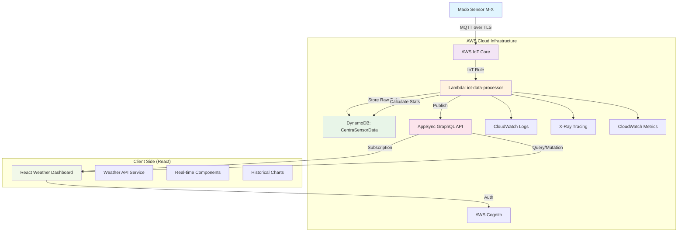

# 気象センサー統合システム 設計書

## 概要

AWS Amplify Gen2 環境において、Mado センサー（M-X）から Web アプリケーションまでのエンドツーエンドなデータフローを実現するサーバーレスアーキテクチャ。既存の Centra アプリケーションに統合し、リアルタイム性、スケーラビリティ、コスト効率を最適化した設計。

## アーキテクチャ

### システム全体構成



### データフロー詳細

#### 1. リアルタイムデータフロー

```
Madoセンサー → IoT Core → Lambda → AppSync → React
遅延目標: < 500ms (要件: 500ms以内)
```

#### 2. 履歴データフロー

```
React → AppSync Query → DynamoDB → React
応答時間: < 200ms (要件: 95%のリクエストが200ms以内)
```

#### 3. 統計データフロー

```
Lambda → 10分間隔集計 → DynamoDB → AppSync → React
更新頻度: 10分毎（電源投入後即座に開始）
```

## コンポーネントとインターフェース

### バックエンドコンポーネント

#### 1. IoT Core 設定

**IoT Thing Type 定義**

```typescript
// amplify/iot/resource.ts
export const createIoTThingType = (stack: Stack) => {
  return new iot.CfnThingType(stack, "MadoSensorThingType", {
    thingTypeName: "MadoSensorDevice",
    thingTypeProperties: {
      thingTypeDescription: "Thing type for Mado weather sensor devices",
      searchableAttributes: ["deviceId", "location", "sensorType"],
    },
  });
};
```

**IoT Rule 設定**

```typescript
// MQTTトピック: mado/centra/+/telemetry
// SQL: "SELECT *, timestamp() as iot_timestamp FROM 'mado/centra/+/telemetry'"
export const createIoTRule = (
  stack: Stack,
  lambdaFunctionArn: string,
  roleArn: string
) => {
  return new iot.CfnTopicRule(stack, "MadoSensorDataToLambda", {
    ruleName: "MadoSensorDataToLambda",
    topicRulePayload: {
      sql: "SELECT *, timestamp() as iot_timestamp FROM 'mado/centra/+/telemetry'",
      description: "Process Mado sensor data through Lambda function",
      actions: [{ lambda: { functionArn: lambdaFunctionArn } }],
      ruleDisabled: false,
      errorAction: {
        cloudwatchLogs: {
          logGroupName: "/aws/iot/rule/MadoSensorDataToLambda/error",
          roleArn: roleArn,
        },
      },
    },
  });
};
```

#### 2. Lambda Function: iot-data-processor

**責務と機能**

- IoT Core からのデータ受信・バリデーション
- DynamoDB への生データ保存（TTL: 1 時間）
- 10 分間隔での統計データ計算・保存（TTL: 24 時間）
- AppSync へのリアルタイム配信

**データ処理フロー**

```typescript
export const handler = async (
  event: IoTEvent,
  context: Context
): Promise<void> => {
  try {
    // 1. データバリデーション
    const sensorData = validateAndExtractSensorData(event);

    // 2. 生データ保存
    await saveRawDataToDynamoDB(sensorData);

    // 3. リアルタイム配信
    await publishToAppSync(sensorData);

    // 4. 統計計算（10分毎）
    if (shouldCalculateStats()) {
      await calculateAndSaveStats(sensorData.deviceId);
    }
  } catch (error) {
    // エラーハンドリング
    console.error("IoTデータ処理エラー:", error);
    throw error;
  }
};
```

**統計計算ロジック**

```typescript
// 電源投入後即座に統計計算を開始
async function calculateAndSaveStats(deviceId: string): Promise<void> {
  // 現在時刻から直近10分間のデータを取得
  const rawDataList = await getRecentRawData(deviceId, 10);

  if (rawDataList.length === 0) {
    console.log("統計計算用のデータが不足しています");
    return;
  }

  // 各気象要素の統計値を計算
  const stats = calculateTenMinuteStats(rawDataList);

  // DynamoDBに保存
  await saveStatsToDynamoDB(deviceId, stats, periodStart, periodEnd);
}
```

#### 3. DynamoDB テーブル設計

**テーブル名**: `CentraSensorData`

**パーティション設計**

```typescript
interface DynamoDBRecord {
  PK: string; // "DEVICE#{deviceId}"
  SK: string; // "{timestamp}#{type}"
  type: "RAW" | "STATS_10MIN";
  deviceId: string;
  timestamp: string; // ISO 8601
  ttl: number; // RAW: 3600秒, STATS: 86400秒

  // 生データフィールド (type=RAW)
  temperature?: number; // ℃
  humidity?: number; // %
  pressure?: number; // hPa
  windSpeed?: number; // m/s
  windDirection?: number; // degrees
  rainfall?: number; // mm
  illuminance?: number; // lux
  visibility?: number; // km
  feelsLike?: number; // ℃

  // 統計データフィールド (type=STATS_10MIN)
  temperatureMax?: number;
  temperatureMin?: number;
  temperatureAvg?: number;
  // ... 他の気象要素の統計値
  samples: number; // サンプル数
  period: string; // "HOUR" | "DAY"
  startTime: string; // 統計期間開始
  endTime: string; // 統計期間終了
}
```

**インデックス設計**

```typescript
// GSI1: デバイス別時系列クエリ用
// PK: deviceId, SK: timestamp
// 用途: 特定デバイスの時系列データ取得

// GSI2: データタイプ別クエリ用
// PK: deviceId, SK: type#timestamp
// 用途: 生データまたは統計データのみ取得
```

**TTL 設定**

```typescript
// 生データ: 1時間後に自動削除
const rawDataTTL = Math.floor(Date.now() / 1000) + 60 * 60;

// 統計データ: 24時間後に自動削除
const statsDataTTL = Math.floor(Date.now() / 1000) + 24 * 60 * 60;
```

#### 4. AppSync GraphQL API

**スキーマ定義**

```graphql
# 基本データ型
type SensorData {
  deviceId: ID!
  timestamp: AWSDateTime!
  temperature: Float
  humidity: Float
  pressure: Float
  windSpeed: Float
  windDirection: Float
  rainfall: Float
  illuminance: Float
  visibility: Float
  feelsLike: Float
}

# 統計データ型
type SensorStats {
  deviceId: ID!
  timestamp: AWSDateTime!
  period: StatsPeriod!
  startTime: AWSDateTime!
  endTime: AWSDateTime!
  samples: Int!

  temperatureMax: Float
  temperatureMin: Float
  temperatureAvg: Float
  humidityMax: Float
  humidityMin: Float
  humidityAvg: Float
  windSpeedMax: Float
  windSpeedMin: Float
  windSpeedAvg: Float
  # ... 他の統計値
}

enum StatsPeriod {
  HOUR
  DAY
}

# クエリ
type Query {
  getCurrentSensorData(deviceId: ID!): SensorData
  getRecentSensorData(
    deviceId: ID!
    minutes: Int = 60
    limit: Int = 100
  ): [SensorData!]!
  getSensorStats(
    deviceId: ID!
    period: StatsPeriod = HOUR
    limit: Int = 6
  ): [SensorStats!]!
}

# ミューテーション
type Mutation {
  publishSensorData(input: SensorDataInput!): SensorData
}

# サブスクリプション
type Subscription {
  onSensorDataUpdate(deviceId: ID!): SensorData
    @aws_subscribe(mutations: ["publishSensorData"])
}

# 入力型
input SensorDataInput {
  deviceId: ID!
  timestamp: AWSDateTime!
  temperature: Float
  humidity: Float
  pressure: Float
  windSpeed: Float
  windDirection: Float
  rainfall: Float
  illuminance: Float
  visibility: Float
  feelsLike: Float
}
```

**リゾルバー設計**

```typescript
// amplify/data/resource.ts
export const data = defineData({
  schema: a.schema({
    CentraSensorData: a
      .model({
        PK: a.string().required(),
        SK: a.string().required(),
        type: a.enum(["RAW", "STATS_10MIN"]),
        deviceId: a.string().required(),
        timestamp: a.datetime().required(),
        ttl: a.integer(),

        // 生データフィールド
        temperature: a.float(),
        humidity: a.float(),
        pressure: a.float(),
        windSpeed: a.float(),
        windDirection: a.float(),
        rainfall: a.float(),
        illuminance: a.float(),
        visibility: a.float(),
        feelsLike: a.float(),

        // 統計データフィールド
        temperatureMax: a.float(),
        temperatureMin: a.float(),
        temperatureAvg: a.float(),
        // ... 他の統計フィールド
        samples: a.integer(),
        period: a.string(),
        startTime: a.datetime(),
        endTime: a.datetime(),
      })
      .identifier(["PK", "SK"])
      .secondaryIndexes((index) => [
        index("deviceId").sortKeys(["timestamp"]),
        index("deviceId").sortKeys(["type", "timestamp"]),
      ]),
  }),
});
```

### フロントエンドコンポーネント

#### 1. Weather API Service

**責務**: AppSync クライアントの管理とデータアクセス

```typescript
// src/services/weatherApi.ts
export class WeatherApiService {
  private client: GraphQLClient;

  constructor() {
    this.client = generateClient();
  }

  // 最新データ取得
  async getCurrentData(deviceId: string): Promise<SensorData | null> {
    const result = await this.client.graphql({
      query: getCurrentSensorData,
      variables: { deviceId },
    });
    return result.data?.getCurrentSensorData || null;
  }

  // 履歴データ取得
  async getHistoricalData(
    deviceId: string,
    minutes: number = 60
  ): Promise<SensorData[]> {
    const result = await this.client.graphql({
      query: getRecentSensorData,
      variables: { deviceId, minutes },
    });
    return result.data?.getRecentSensorData || [];
  }

  // 統計データ取得
  async getStatistics(
    deviceId: string,
    period: StatsPeriod = StatsPeriod.HOUR
  ): Promise<SensorStats[]> {
    const result = await this.client.graphql({
      query: getSensorStats,
      variables: { deviceId, period },
    });
    return result.data?.getSensorStats || [];
  }

  // リアルタイム更新の購読
  subscribeToUpdates(
    deviceId: string,
    callback: (data: SensorData) => void
  ): () => void {
    const subscription = this.client
      .graphql({
        query: onSensorDataUpdate,
        variables: { deviceId },
      })
      .subscribe({
        next: ({ data }) => {
          if (data?.onSensorDataUpdate) {
            callback(data.onSensorDataUpdate);
          }
        },
        error: (error) => {
          console.error("Subscription error:", error);
        },
      });

    return () => subscription.unsubscribe();
  }
}
```

#### 2. React Hooks

**useWeatherData Hook**

```typescript
// src/hooks/useWeatherData.ts
export interface UseWeatherDataResult {
  currentData: SensorData | null;
  historicalData: SensorData[];
  statistics: SensorStats[];
  loading: boolean;
  error: Error | null;
  connectionStatus: "connected" | "disconnected" | "reconnecting";
  retry: () => void;
}

export const useWeatherData = (deviceId: string): UseWeatherDataResult => {
  const [currentData, setCurrentData] = useState<SensorData | null>(null);
  const [historicalData, setHistoricalData] = useState<SensorData[]>([]);
  const [statistics, setStatistics] = useState<SensorStats[]>([]);
  const [loading, setLoading] = useState(true);
  const [error, setError] = useState<Error | null>(null);
  const [connectionStatus, setConnectionStatus] = useState<
    "connected" | "disconnected" | "reconnecting"
  >("disconnected");

  const weatherApi = useMemo(() => new WeatherApiService(), []);

  // 初期データ読み込み
  useEffect(() => {
    const loadInitialData = async () => {
      try {
        setLoading(true);
        setError(null);

        const [current, historical, stats] = await Promise.all([
          weatherApi.getCurrentData(deviceId),
          weatherApi.getHistoricalData(deviceId, 60),
          weatherApi.getStatistics(deviceId, StatsPeriod.HOUR),
        ]);

        setCurrentData(current);
        setHistoricalData(historical);
        setStatistics(stats);
        setConnectionStatus("connected");
      } catch (err) {
        setError(
          err instanceof Error ? err : new Error("データ読み込みエラー")
        );
        setConnectionStatus("disconnected");
      } finally {
        setLoading(false);
      }
    };

    loadInitialData();
  }, [deviceId, weatherApi]);

  // リアルタイム更新の購読
  useEffect(() => {
    const unsubscribe = weatherApi.subscribeToUpdates(deviceId, (newData) => {
      setCurrentData(newData);
      setConnectionStatus("connected");

      // 履歴データの更新
      setHistoricalData((prev) => {
        const updated = [...prev, newData];
        // 1時間以内のデータのみ保持
        const oneHourAgo = new Date(Date.now() - 60 * 60 * 1000);
        return updated.filter((data) => new Date(data.timestamp) > oneHourAgo);
      });
    });

    return unsubscribe;
  }, [deviceId, weatherApi]);

  const retry = useCallback(() => {
    setConnectionStatus("reconnecting");
    // 再接続ロジック
  }, []);

  return {
    currentData,
    historicalData,
    statistics,
    loading,
    error,
    connectionStatus,
    retry,
  };
};
```

#### 3. UI Components

**RealtimeWeatherCard**

```typescript
// src/components/weather/RealtimeWeatherCard.tsx
interface RealtimeWeatherCardProps {
  deviceId: string;
  className?: string;
}

export const RealtimeWeatherCard: React.FC<RealtimeWeatherCardProps> = ({
  deviceId,
  className,
}) => {
  const { currentData, loading, error, connectionStatus } =
    useWeatherData(deviceId);

  if (loading) {
    return <WeatherCardSkeleton />;
  }

  if (error) {
    return <WeatherErrorCard error={error} />;
  }

  return (
    <Card className={className}>
      <CardHeader>
        <Typography variant="h6">リアルタイム気象データ</Typography>
        <ConnectionStatusIndicator status={connectionStatus} />
      </CardHeader>

      <CardContent>
        <Grid container spacing={2}>
          <Grid item xs={6} sm={3}>
            <WeatherMetric
              label="気温"
              value={currentData?.temperature}
              unit="℃"
              icon={<ThermostatIcon />}
            />
          </Grid>

          <Grid item xs={6} sm={3}>
            <WeatherMetric
              label="湿度"
              value={currentData?.humidity}
              unit="%"
              icon={<OpacityIcon />}
            />
          </Grid>

          <Grid item xs={6} sm={3}>
            <WeatherMetric
              label="風速"
              value={currentData?.windSpeed}
              unit="m/s"
              icon={<AirIcon />}
            />
          </Grid>

          <Grid item xs={6} sm={3}>
            <WeatherMetric
              label="気圧"
              value={currentData?.pressure}
              unit="hPa"
              icon={<CompressIcon />}
            />
          </Grid>
        </Grid>

        <Box mt={2}>
          <Typography variant="caption" color="textSecondary">
            最終更新:{" "}
            {currentData?.timestamp
              ? new Date(currentData.timestamp).toLocaleString("ja-JP")
              : "---"}
          </Typography>
        </Box>
      </CardContent>
    </Card>
  );
};
```

**WeatherHistoryChart**

```typescript
// src/components/weather/WeatherHistoryChart.tsx
interface WeatherHistoryChartProps {
  deviceId: string;
  dataType: WeatherDataType;
  timeRange: number; // minutes
}

export const WeatherHistoryChart: React.FC<WeatherHistoryChartProps> = ({
  deviceId,
  dataType,
  timeRange,
}) => {
  const { historicalData, loading } = useWeatherData(deviceId);

  const chartData = useMemo(() => {
    return historicalData
      .map((data) => ({
        timestamp: new Date(data.timestamp).getTime(),
        value: data[dataType] || null,
      }))
      .filter((item) => item.value !== null);
  }, [historicalData, dataType]);

  const chartOptions: ApexOptions = {
    chart: {
      type: "line",
      height: 300,
      animations: {
        enabled: true,
        easing: "easeinout",
        speed: 800,
      },
    },
    xaxis: {
      type: "datetime",
      labels: {
        format: "HH:mm",
      },
    },
    yaxis: {
      title: {
        text: getUnitForDataType(dataType),
      },
    },
    stroke: {
      curve: "smooth",
      width: 2,
    },
    colors: ["#3498db"],
    grid: {
      borderColor: "#e0e0e0",
    },
  };

  if (loading) {
    return <ChartSkeleton />;
  }

  return (
    <Card>
      <CardHeader>
        <Typography variant="h6">
          {getDisplayNameForDataType(dataType)} - 過去{timeRange}分
        </Typography>
      </CardHeader>

      <CardContent>
        <ApexChart
          options={chartOptions}
          series={[
            {
              name: getDisplayNameForDataType(dataType),
              data: chartData,
            },
          ]}
          type="line"
          height={300}
        />
      </CardContent>
    </Card>
  );
};
```

## データモデル

### TypeScript 型定義

```typescript
// src/types/weather.ts

export interface SensorData {
  deviceId: string;
  timestamp: string;
  temperature?: number; // ℃
  humidity?: number; // %
  pressure?: number; // hPa
  windSpeed?: number; // m/s
  windDirection?: number; // degrees
  rainfall?: number; // mm
  illuminance?: number; // lux
  visibility?: number; // km
  feelsLike?: number; // ℃
}

export interface SensorStats {
  deviceId: string;
  timestamp: string;
  period: StatsPeriod;
  startTime: string;
  endTime: string;
  samples: number;

  temperatureMax?: number;
  temperatureMin?: number;
  temperatureAvg?: number;
  humidityMax?: number;
  humidityMin?: number;
  humidityAvg?: number;
  pressureMax?: number;
  pressureMin?: number;
  pressureAvg?: number;
  windSpeedMax?: number;
  windSpeedMin?: number;
  windSpeedAvg?: number;
  windDirectionMax?: number;
  windDirectionMin?: number;
  windDirectionAvg?: number;
  rainfallMax?: number;
  rainfallMin?: number;
  rainfallAvg?: number;
  illuminanceMax?: number;
  illuminanceMin?: number;
  illuminanceAvg?: number;
  visibilityMax?: number;
  visibilityMin?: number;
  visibilityAvg?: number;
  feelsLikeMax?: number;
  feelsLikeMin?: number;
  feelsLikeAvg?: number;
}

export enum StatsPeriod {
  HOUR = "HOUR",
  DAY = "DAY",
}

export enum WeatherDataType {
  TEMPERATURE = "temperature",
  HUMIDITY = "humidity",
  PRESSURE = "pressure",
  WIND_SPEED = "windSpeed",
  WIND_DIRECTION = "windDirection",
  RAINFALL = "rainfall",
  ILLUMINANCE = "illuminance",
  VISIBILITY = "visibility",
  FEELS_LIKE = "feelsLike",
}

export interface ConnectionStatus {
  status: "connected" | "disconnected" | "reconnecting";
  lastUpdate?: Date;
  errorCount: number;
}
```

## エラーハンドリング

### エラー分類と対応戦略

#### 1. ネットワークエラー

```typescript
// 指数バックオフによる再接続
class ConnectionManager {
  private retryCount = 0;
  private maxRetries = 5;

  async reconnect(): Promise<void> {
    const delay = Math.min(1000 * Math.pow(2, this.retryCount), 30000);

    await new Promise((resolve) => setTimeout(resolve, delay));

    try {
      await this.establishConnection();
      this.retryCount = 0;
    } catch (error) {
      this.retryCount++;
      if (this.retryCount < this.maxRetries) {
        return this.reconnect();
      }
      throw error;
    }
  }
}
```

#### 2. データバリデーションエラー

```typescript
// Lambda関数でのバリデーション
function validateSensorData(data: any): MadoSensorData {
  const errors: string[] = [];

  if (!data.device_id) {
    errors.push("デバイスIDが必要です");
  }

  if (data.data?.temperature !== undefined) {
    const temp = Number(data.data.temperature);
    if (isNaN(temp) || temp < -50 || temp > 60) {
      errors.push("温度の値が無効です");
    }
  }

  if (errors.length > 0) {
    throw new ValidationError(errors.join(", "));
  }

  return extractSensorData(data);
}
```

#### 3. DynamoDB エラー

```typescript
// スロットリング対応
async function saveToDynamoDBWithRetry(
  record: DynamoDBRecord,
  maxRetries: number = 3
): Promise<void> {
  for (let attempt = 1; attempt <= maxRetries; attempt++) {
    try {
      await dynamoClient.send(
        new PutItemCommand({
          TableName: tableName,
          Item: marshall(record),
        })
      );
      return;
    } catch (error) {
      if (
        error.name === "ProvisionedThroughputExceededException" &&
        attempt < maxRetries
      ) {
        const delay = 100 * Math.pow(2, attempt);
        await new Promise((resolve) => setTimeout(resolve, delay));
        continue;
      }
      throw error;
    }
  }
}
```

## テスト戦略

### 単体テスト

#### Lambda 関数テスト

```typescript
// amplify/functions/iot-data-processor/handler.test.ts
describe("IoT Data Processor", () => {
  beforeEach(() => {
    // DynamoDB Mockの設定
    mockDynamoDBClient.reset();
  });

  test("正常なセンサーデータの処理", async () => {
    const mockEvent: IoTEvent = {
      device_id: "M-X-001",
      timestamp: "2025-01-27T12:00:00.000Z",
      data: {
        temperature: 25.5,
        humidity: 60.0,
        wind_speed: 3.2,
      },
    };

    await handler(mockEvent, mockContext);

    expect(mockDynamoDBClient.send).toHaveBeenCalledWith(
      expect.objectContaining({
        input: expect.objectContaining({
          TableName: "CentraSensorData",
          Item: expect.objectContaining({
            PK: { S: "DEVICE#M-X-001" },
            type: { S: "RAW" },
          }),
        }),
      })
    );
  });

  test("統計データの計算", async () => {
    // 10分間のモックデータを準備
    const mockRawData = generateMockRawData(10);

    const stats = calculateTenMinuteStats(mockRawData);

    expect(stats.samples).toBe(10);
    expect(stats.temperature?.max).toBeGreaterThanOrEqual(
      stats.temperature?.min
    );
    expect(stats.windSpeed?.max).toBeDefined();
  });
});
```

#### React Hooks テスト

```typescript
// src/hooks/__tests__/useWeatherData.test.ts
describe("useWeatherData", () => {
  test("初期データの読み込み", async () => {
    const mockData: SensorData = {
      deviceId: "M-X-001",
      timestamp: "2025-01-27T12:00:00.000Z",
      temperature: 25.5,
      humidity: 60.0,
    };

    mockWeatherApi.getCurrentData.mockResolvedValue(mockData);

    const { result, waitForNextUpdate } = renderHook(() =>
      useWeatherData("M-X-001")
    );

    expect(result.current.loading).toBe(true);

    await waitForNextUpdate();

    expect(result.current.loading).toBe(false);
    expect(result.current.currentData).toEqual(mockData);
  });

  test("リアルタイム更新の処理", async () => {
    const { result } = renderHook(() => useWeatherData("M-X-001"));

    // サブスクリプションのコールバックをシミュレート
    const newData: SensorData = {
      deviceId: "M-X-001",
      timestamp: "2025-01-27T12:01:00.000Z",
      temperature: 26.0,
    };

    act(() => {
      mockSubscriptionCallback(newData);
    });

    expect(result.current.currentData).toEqual(newData);
  });
});
```

### 統合テスト

#### AppSync API テスト

```typescript
// src/tests/integration/weatherApi.integration.test.ts
describe("Weather API Integration", () => {
  test("GraphQLクエリの実行", async () => {
    const weatherApi = new WeatherApiService();

    const result = await weatherApi.getCurrentData("M-X-001");

    expect(result).toBeDefined();
    expect(result?.deviceId).toBe("M-X-001");
  });

  test("サブスクリプションの動作", (done) => {
    const weatherApi = new WeatherApiService();

    const unsubscribe = weatherApi.subscribeToUpdates("M-X-001", (data) => {
      expect(data.deviceId).toBe("M-X-001");
      unsubscribe();
      done();
    });

    // テストデータの送信
    setTimeout(() => {
      publishTestData("M-X-001");
    }, 100);
  });
});
```

### E2E テスト

#### Cypress テスト

```typescript
// cypress/e2e/weather-dashboard.cy.ts
describe("Weather Dashboard E2E", () => {
  beforeEach(() => {
    cy.login("test@example.com", "password");
    cy.visit("/weather");
  });

  test("リアルタイムデータの表示", () => {
    // 既存IoTセンサーからの実データを待機
    cy.waitForRealSensorData("M-X-001");

    // UIの確認（実際のセンサーデータが表示されることを確認）
    cy.get('[data-testid="temperature-value"]').should("not.be.empty");
    cy.get('[data-testid="humidity-value"]').should("not.be.empty");
    cy.get('[data-testid="connection-status"]').should("contain", "接続中");
  });

  test("履歴チャートの表示", () => {
    cy.get('[data-testid="history-chart"]').should("be.visible");
    cy.get('[data-testid="chart-data-points"]').should(
      "have.length.greaterThan",
      0
    );
  });
});
```

## セキュリティ設計

### 認証・認可

#### Cognito 統合

```typescript
// src/config/amplifyConfig.ts
export const amplifyConfig = {
  Auth: {
    Cognito: {
      userPoolId: process.env.VITE_USER_POOL_ID!,
      userPoolClientId: process.env.VITE_USER_POOL_CLIENT_ID!,
      identityPoolId: process.env.VITE_IDENTITY_POOL_ID!,
      loginWith: {
        email: true,
      },
    },
  },
  API: {
    GraphQL: {
      endpoint: process.env.VITE_APPSYNC_ENDPOINT!,
      region: process.env.VITE_AWS_REGION!,
      defaultAuthMode: "userPool",
    },
  },
};
```

#### IoT デバイス認証

```typescript
// IoTデバイス用のX.509証明書認証
export const createIoTPolicy = (
  stack: Stack,
  accountId: string,
  region: string
) => {
  return new iot.CfnPolicy(stack, "CentraIoTPolicy", {
    policyName: "CentraIoTPolicy",
    policyDocument: {
      Version: "2012-10-17",
      Statement: [
        {
          Effect: "Allow",
          Action: ["iot:Connect", "iot:Publish"],
          Resource: [
            `arn:aws:iot:${region}:${accountId}:client/\${iot:Connection.Thing.ThingName}`,
            `arn:aws:iot:${region}:${accountId}:topic/mado/centra/\${iot:Connection.Thing.ThingName}/telemetry`,
          ],
        },
      ],
    },
  });
};
```

### データ保護

#### GraphQL セキュリティ

```typescript
// Depth Limitの設定
const depthLimit = require("graphql-depth-limit");

const server = new ApolloServer({
  typeDefs,
  resolvers,
  validationRules: [depthLimit(7)],
  introspection: process.env.NODE_ENV !== "production",
  playground: process.env.NODE_ENV !== "production",
});
```

#### 入力サニタイゼーション

```typescript
// Lambda関数での入力検証
function sanitizeInput(input: any): any {
  if (typeof input === "string") {
    return input.replace(
      /<script\b[^<]*(?:(?!<\/script>)<[^<]*)*<\/script>/gi,
      ""
    );
  }

  if (typeof input === "object" && input !== null) {
    const sanitized: any = {};
    for (const [key, value] of Object.entries(input)) {
      sanitized[key] = sanitizeInput(value);
    }
    return sanitized;
  }

  return input;
}
```

## 運用・監視

### メトリクス定義

#### CloudWatch メトリクス

```typescript
// Lambda関数でのカスタムメトリクス送信
import {
  CloudWatchClient,
  PutMetricDataCommand,
} from "@aws-sdk/client-cloudwatch";

const cloudWatch = new CloudWatchClient({ region: process.env.AWS_REGION });

async function publishMetrics(
  deviceId: string,
  processingTime: number
): Promise<void> {
  await cloudWatch.send(
    new PutMetricDataCommand({
      Namespace: "Centra/WeatherSensor",
      MetricData: [
        {
          MetricName: "ProcessingLatency",
          Value: processingTime,
          Unit: "Milliseconds",
          Dimensions: [
            {
              Name: "DeviceId",
              Value: deviceId,
            },
          ],
        },
      ],
    })
  );
}
```

#### アラート設定

```typescript
// CDKでのアラーム設定
const errorAlarm = new cloudwatch.Alarm(stack, "LambdaErrorAlarm", {
  metric: lambdaFunction.metricErrors(),
  threshold: 5,
  evaluationPeriods: 2,
  treatMissingData: cloudwatch.TreatMissingData.NOT_BREACHING,
});

const latencyAlarm = new cloudwatch.Alarm(stack, "LatencyAlarm", {
  metric: new cloudwatch.Metric({
    namespace: "Centra/WeatherSensor",
    metricName: "ProcessingLatency",
    statistic: "Average",
  }),
  threshold: 1000, // 1秒
  evaluationPeriods: 3,
});
```

### ログ管理

#### 構造化ログ

```typescript
// Lambda関数での構造化ログ出力
interface LogEntry {
  timestamp: string;
  level: "INFO" | "WARN" | "ERROR";
  requestId: string;
  deviceId?: string;
  message: string;
  metadata?: any;
}

function logInfo(message: string, metadata?: any): void {
  const entry: LogEntry = {
    timestamp: new Date().toISOString(),
    level: "INFO",
    requestId: context.awsRequestId,
    deviceId: metadata?.deviceId,
    message,
    metadata,
  };

  console.log(JSON.stringify(entry));
}
```

## デプロイメント

### Infrastructure as Code

#### AWS CDK 設定

```typescript
// amplify/backend.ts
export const backend = defineBackend({
  auth,
  data,
  iotDataProcessor,
});

// 環境別設定
const environmentConfig = {
  dev: {
    dynamodbBillingMode: BillingMode.PAY_PER_REQUEST,
    lambdaReservedConcurrency: 5,
  },
  prod: {
    dynamodbBillingMode: BillingMode.PROVISIONED,
    lambdaReservedConcurrency: 20,
  },
};

const config = environmentConfig[process.env.NODE_ENV || "dev"];
```

#### CI/CD パイプライン

```yaml
# .github/workflows/deploy.yml
name: Deploy Weather Sensor Integration

on:
  push:
    branches: [main, develop]

jobs:
  test:
    runs-on: ubuntu-latest
    steps:
      - uses: actions/checkout@v3
      - uses: actions/setup-node@v3
        with:
          node-version: "18"

      - name: Install dependencies
        run: npm ci

      - name: Run tests
        run: npm run test:ci

      - name: Run integration tests
        run: npm run test:integration

  deploy:
    needs: test
    runs-on: ubuntu-latest
    if: github.ref == 'refs/heads/main'

    steps:
      - uses: actions/checkout@v3

      - name: Configure AWS credentials
        uses: aws-actions/configure-aws-credentials@v2
        with:
          aws-access-key-id: ${{ secrets.AWS_ACCESS_KEY_ID }}
          aws-secret-access-key: ${{ secrets.AWS_SECRET_ACCESS_KEY }}
          aws-region: ap-northeast-1

      - name: Deploy to production
        run: |
          cd 01_app
          npx ampx deploy --branch main
```

### 環境管理

#### 環境変数設定

```bash
# .env.production
VITE_AWS_REGION=ap-northeast-1
VITE_APPSYNC_ENDPOINT=https://xxx.appsync-api.ap-northeast-1.amazonaws.com/graphql
VITE_USER_POOL_ID=ap-northeast-1_xxxxxxxxx
VITE_USER_POOL_CLIENT_ID=xxxxxxxxxxxxxxxxxxxxxxxxxx
VITE_IDENTITY_POOL_ID=ap-northeast-1:xxxxxxxx-xxxx-xxxx-xxxx-xxxxxxxxxxxx

# Lambda環境変数
DYNAMODB_TABLE_NAME=CentraSensorData-prod
APPSYNC_API_ENDPOINT=https://xxx.appsync-api.ap-northeast-1.amazonaws.com/graphql
AWS_REGION=ap-northeast-1
```

この設計書は、要件書で定義された全ての要件を満たし、既存の Centra アプリケーションとの統合を考慮した実装可能な設計となっています。
